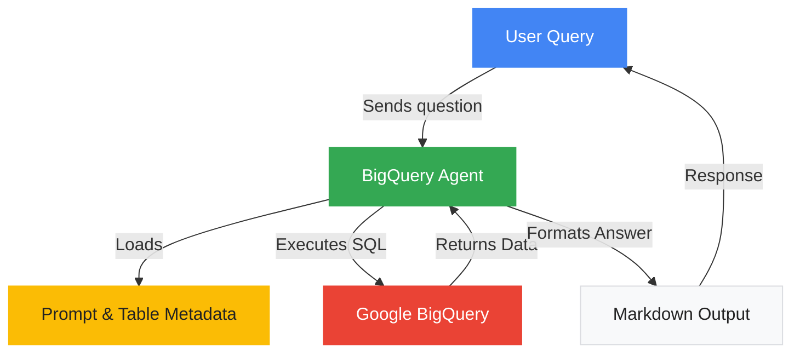

# Retail-Agent-ADK

## Architecture Diagram

 
 ## Overview
 Retail-Agent-ADK is an agent development kit designed to interact with Google BigQuery for retail and e-commerce data analysis. It provides tools and agent logic to query, analyze, and report on product data scraped from e-commerce websites, supporting competitive analysis and merchandising decisions.
 
 ## Features
 - BigQuery agent for executing SQL queries and retrieving data
 - Configurable toolset for read-only or write-blocked operations
 - Uses Google ADK and Gemini model for intelligent data interaction
 - Loads table metadata and prompts for data science tasks
 - Supports markdown output, including tables, images, and links
 
 ## Table Schema
 The agent works with a BigQuery table containing product information:
 - **Uniq_Id**: Unique identifier for the product listing
 - **Crawl_Timestamp**: Timestamp when the product data was crawled
 - **Product_Url**: URL of the product page
 - **Product_Name**: Name of the product
 - **Description**: Detailed description
 - **List_Price**: Original list price
 - **Sale_Price**: Current sale price
 - **Brand**: Brand name
 - **Item_Number**: Unique item number
 - **Gtin**: Global Trade Item Number
 - **Package_Size**: Size or quantity of the package
 - **Category**: Product category
 - **Postal_Code**: Postal code for the listing
 - **Available**: Availability status
 
 ## Setup
 1. Clone the repository:
	 ```bash
	 git clone https://github.com/Wiikay/Retail-Agent-ADK.git
	 cd Retail-Agent-ADK
	 ```
 2. Install dependencies (Python, Google ADK, dotenv):
	 ```bash
	 pip install -r requirements.txt
	 ```
 3. Set up environment variables in a `.env` file:
	 ```env
	 TABLE_ID=your_bigquery_table_id
	 ```
 4. Ensure Google Application Default Credentials are configured:
	 [Google Cloud Authentication Guide](https://cloud.google.com/docs/authentication/provide-credentials-adc)
 
 ## Usage
 - Run the agent to interact with BigQuery data:
	- Configure prompts and table metadata in `bigquery-project/prompt.py`
	- Use the agent logic in `bigquery-project/agent.py` to execute queries and retrieve results
 - Answers are returned in markdown format, supporting tables, images, and links
 
 ## License
 Licensed under the Apache License, Version 2.0. See [LICENSE](LICENSE) for details.
 
 ## Contact
 For questions or support, contact the repository owner or open an issue on GitHub.